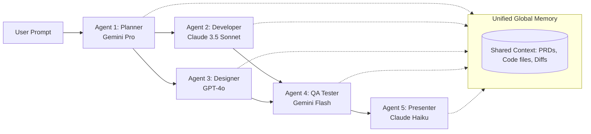

# Blueprint: Multi-Agent Workflow Playground 🤖🕸️

This document outlines the architecture, design, and step-by-step implementation plan for building a single-file visual dashboard where user prompts pass through a network of customizable, multi-platform AI agents sharing a single memory space.

We will develop this system on your new laptop.

---

## 1. Core Vision & Concept
The goal is to build an interactive, frontend-only **Agent Canvas** that allows anyone to design, configure, and execute multi-agent pipelines directly from a web browser.

---

## 2. Key Features

### 🔌 Hybrid Model Routing Support
Every single agent (node) on the canvas can be configured to run on a different hosting model to optimize speed and eliminate token costs:
* **Platform Integrations (Free via Local CLI):** Direct hooks into your authenticated local terminal environments for:
  * **Google Antigravity / Gemini IDE Agent** (runs local commands)
  * **Claude Code CLI** (runs Claude locally using terminal sessions)
  * **GitHub Copilot / Codex CLI**
* **Cloud API Integrations (API-Key based):** Traditional cloud endpoint calls for heavy GPT/Claude models.
* **Lighter / Free Tiers (Cost-Effective Auxiliary Agents):**
  * **Ollama / Llama.cpp:** 100% offline, local models (e.g. Llama-3, Qwen-2.5) running on your own CPU/GPU for basic formatting, research, and logging.
  * **OpenRouter Free Tier:** For utilizing free cloud endpoints.
  * **Nvidia Developer Preview APIs:** For testing model previews with free developer credits.

### 🧠 Unified Shared Memory
* Instead of isolated conversations, all agents have access to a single shared **State Object**.
* When an agent executes, it receives the *entire updated state*, makes its changes, and passes the updated state to the next agent in the pipeline.

### 🎨 Visual Node Canvas
* Drag-and-drop cards representing agents.
* Draw connection lines (edges) between cards to define the execution flow (sequential or parallel).
* Input box to launch the initial prompt.
* A glowing "pulse" animation traveling along connection lines to show the active executing agent.

---

## 3. Tech Stack (Zero Server Dependencies)
To keep the tool extremely fast, portable, and easy to deploy:
1. **Core:** Single HTML5 file containing all markup, styles, and logic.
2. **Styling:** Premium vanilla CSS with glassmorphic properties, glowing dark-mode aesthetics, and smooth transitions.
3. **Libraries (loaded via CDN):**
   * **Lucide Icons:** For clean developer-focused icons.
   * **LeaderLine / Custom SVG:** For drawing connection lines between cards dynamically.
   * **Local Storage API:** To save your API keys and canvas configurations locally on your machine.

---

## 4. UI Layout & Design Plan

### Left Panel: Memory & Workspace
* Real-time viewing of the **Global Context** (e.g., active code file contents, PRD documentation, current step status).
* Settings button to securely input API Keys.

### Center: The Interactive Canvas
* Visual grid with drag-and-drop agent cards.
* Card anatomy:
  * **Role/Title:** (e.g., "FastAPI Coder")
  * **System Instruction:** (editable text area describing what this specific agent does)
  * **Model Dropdown:** Pick between Claude, Gemini, GPT, etc.
  * **State Inputs/Outputs:** Visual ports showing connections.

### Bottom Panel: Execution console
* Unified input prompt box.
* "Run Pipeline" button.
* Output logs showing live API payloads, token costs, and raw outputs.

---

## 5. Development Roadmap (New Laptop Steps)

### Step 1: UI Base & Theme Definition
Set up the layout using modern styling tokens (glow effects, premium dark layout, glass containers).

### Step 2: Card Dragging & Line Drawing
Implement the drag logic and SVG connection lines to connect Agent A to Agent B.

### Step 3: Global State & API Integrations
Write the client-side JavaScript calls to Google, Anthropic, and OpenAI endpoints, pulling API keys from `localStorage`.

### Step 4: Pipeline Execution Engine
Write the loop logic:
1. Capture initial prompt.
2. Inject it into the first Agent's system prompt + Shared Memory context.
3. Fetch LLM response.
4. Update Shared Memory context.
5. Trigger the next agent connected in the chain (sequential or parallel).

### Step 5: Visual Animations & Polish
Add custom CSS animation triggers so cards glow green/blue/yellow depending on the active API call, and pulses travel down the paths.

---

*Saved locally in `agent_playground_plan.md` to be implemented on your new machine.*
