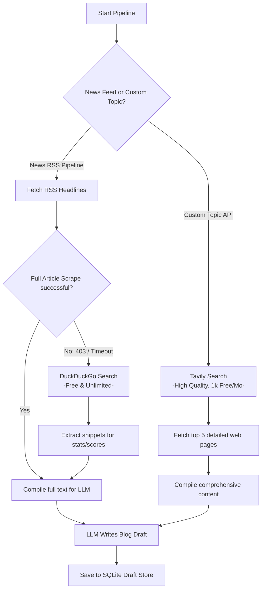

# Crinava Blog Pipeline Checkpoint

> [!IMPORTANT]
> **RESUME KEYWORD:** `CRINAVA_IMAGE_PIPELINE`
> Mention this keyword to the AI in any future session to instantly reload this context and continue working.

---

## 📋 Project Status Summary
This document summarizes the state of the **Automated AI Blog Image Pipeline** as of June 26, 2026. All technical WAF blocks, UI features, and clustering issues have been resolved.

### 1. WAF & Scraping Bypass (`app.py`)
* **Dual Header System:** Split traffic into `RSS_HEADERS` (disguised as Google Chrome to prevent RSS feed blocks from Cricbuzz) and `PAGE_HEADERS` (disguised as the Facebook link crawler to fetch Open Graph details).
* **Proxy Fallback:** Integrated a fallback mechanism using the `allorigins.win` public proxy inside `extract_page_image_urls`. If a target website returns a `403 Forbidden` block (common on cloud hosting like Hugging Face), the engine automatically routes the request through the proxy to fetch the HTML and extract `og:image` successfully.
* **Strict Clustering:** Changed DBSCAN `eps` parameter from `0.72` to `0.45` to prevent mixing unrelated matches (e.g., Men's and Women's T20 series) into the same draft.
* **Limit Upgrades:** Increased the drafts run limit to `150` and the API serving limit to `250` so that all generated drafts are visible.

### 2. Admin Control Center UI (`AdminControlCenter.tsx`)
* **Dynamic Article Counters:** Added live counters on all blog subtabs: `New (X)`, `Old (X)`, `Approved (X)`, and `Revoked (X)` for real-time tracking.
* **Draft Discarding:** Added a **Trash Can icon** on all pending drafts to allow admins to delete unwanted or duplicate drafts instantly before publishing.
* **Manual Uploader:** Added a **"Local File"** button to allow admins to upload images directly from their system.
* **Multi-Image Insertion:** Added an **"Insert Selected Image Into Article Content"** button, enabling admins to insert any selected image link directly into the Markdown editor at the cursor position.

---

## 🛠️ Next Steps / Backlog
* Run a full test of the automatic scraper pipeline by navigating to `/api/run-background` on the blog engine.
* Verify database persistence when publishing custom local file images (Base64 vs URLs).

---

## 🔮 Future Builds: Autonomous RAG Web Search Pipeline
To make the blog engine more powerful and factually accurate without losing the current layout, you can implement a **Search-Based Retrieval-Augmented Generation (RAG)** fallback. This solves factual gaps from scraper blocks (Problem 1) and enables writing custom topics on-demand (Problem 2) while staying 100% free.

### 1. The Architecture (Quota-Safe Hybrid Search)



### 2. Implementation Guide

#### Step A: Dependencies
Add the following to your Hugging Face space's `requirements.txt`:
```text
duckduckgo_search
tavily-python
```

#### Step B: Environment Variables
Get a free API key from [Tavily](https://tavily.com/) (1,000 free searches/month). Add it to Hugging Face **Settings -> Variables and secrets**:
* `TAVILY_API_KEY`: `tvly-xxxxxxxxxxxxxxx`

#### Step C: Code Additions (`app.py`)

1. **DuckDuckGo News Fallback (Free & Unlimited):**
   When `fetch_article_content()` fails due to a 403 error, run a quick search query to pull match facts:
   ```python
   from duckduckgo_search import DDGS

   def search_duckduckgo_stats(headline: str) -> str:
       """Fallback search to retrieve match summaries and scores."""
       try:
           with DDGS() as ddgs:
               results = ddgs.text(f"{headline} scorecard stats match summary", max_results=3)
               return "\n\n".join([r['body'] for r in results])
       except Exception as e:
           print(f"DDG Search failed: {e}")
           return ""
   ```

2. **Tavily Custom Topic Generator (Premium RAG):**
   Add a route to write evergreen articles on-demand:
   ```python
   from tavily import TavilyClient

   @app.get("/api/run-custom")
   def generate_custom_article(topic: str, x_signature: str = Header(None)):
       """Generate a comprehensive blog draft on any custom topic using Tavily Search."""
       if x_signature != ENGINE_SECRET_KEY:
           raise HTTPException(status_code=403, detail="Unauthorized")
       
       # 1. Fetch search data
       tavily = TavilyClient(api_key=os.getenv("TAVILY_API_KEY"))
       response = tavily.search(query=topic, search_depth="advanced", max_results=5)
       
       context = "\n\n".join([result["content"] for result in response["results"]])
       
       # 2. Feed to LLM & Save Draft
       # (Call your existing generate_blog_draft template with the compiled context)
       ...
       return {"status": "success", "message": "Custom draft saved"}
   ```

3. **LLM Prompt Enrichment:**
   Instruct the AI:
   *"Use the provided search context to write an accurate, detail-rich news article. Focus on official scorecards, run counts, player names, and real events. Do not hallucinate stats. Do not include academic citations, write as a primary news source."*

